OB# SplitBills

## About

SplitBills helps you and your friends to split your collective expenses.

Use SplitBills to split bills with your friends or other people. You can create groups with people, add bills to the group and view your balances. SplitBills works without any server or registration and is free software. Your expenses belong to you!

If you have any problems with the app please contact me or open a issue here, rather than leave a one-star review: https://gitlab.com/flexw/splitbills/issues

## Screenshots

### Phone

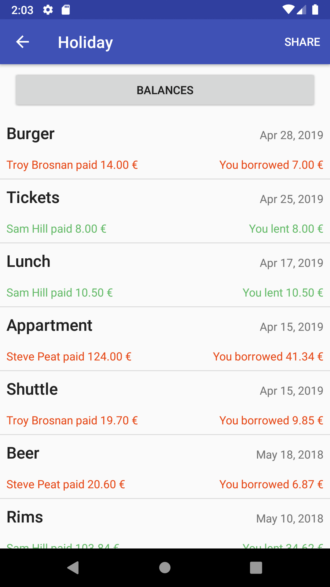
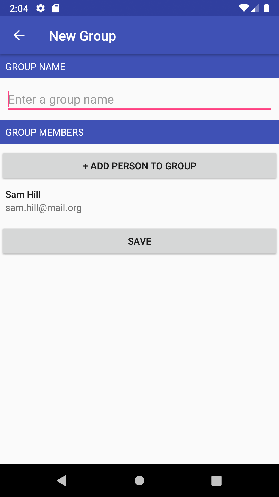
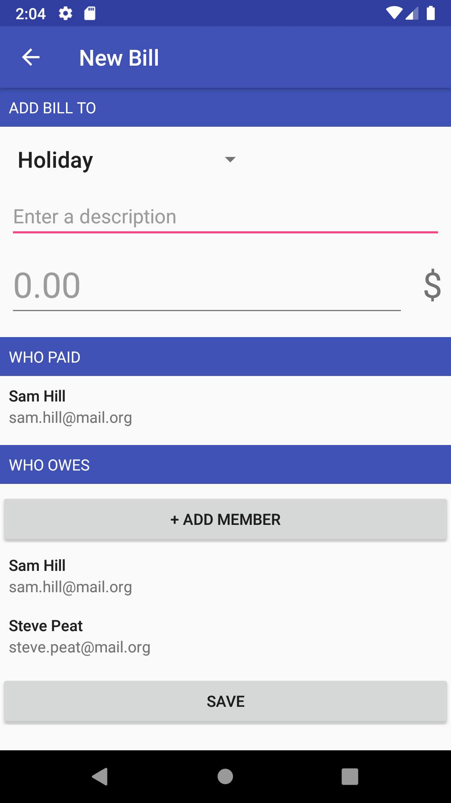
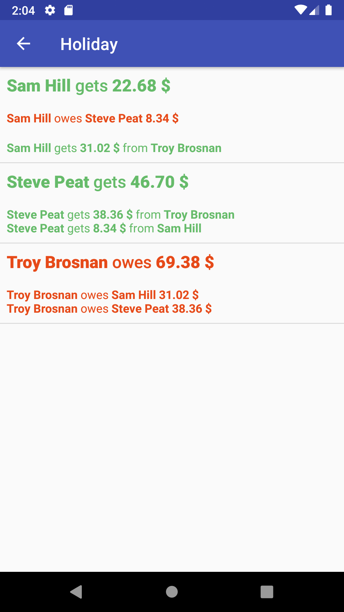
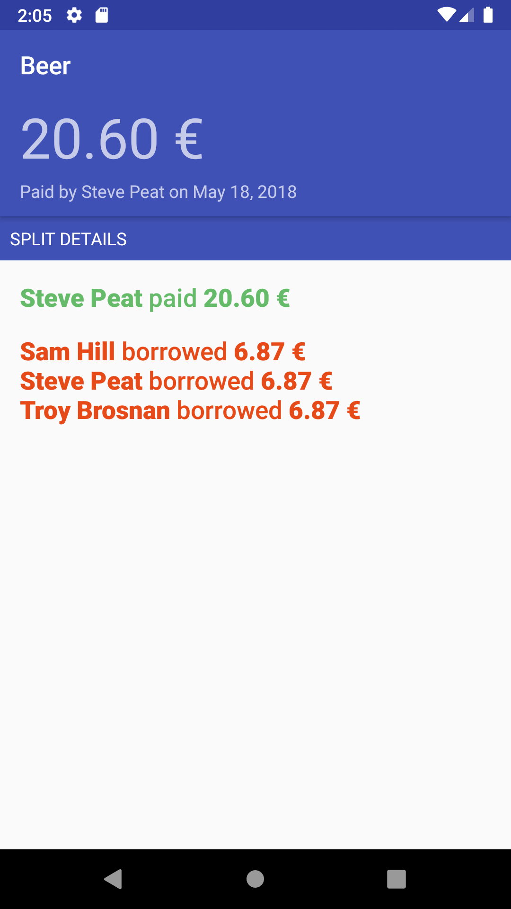

### Tablet

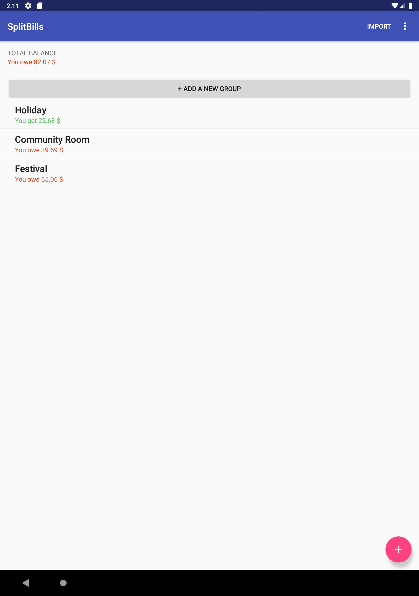
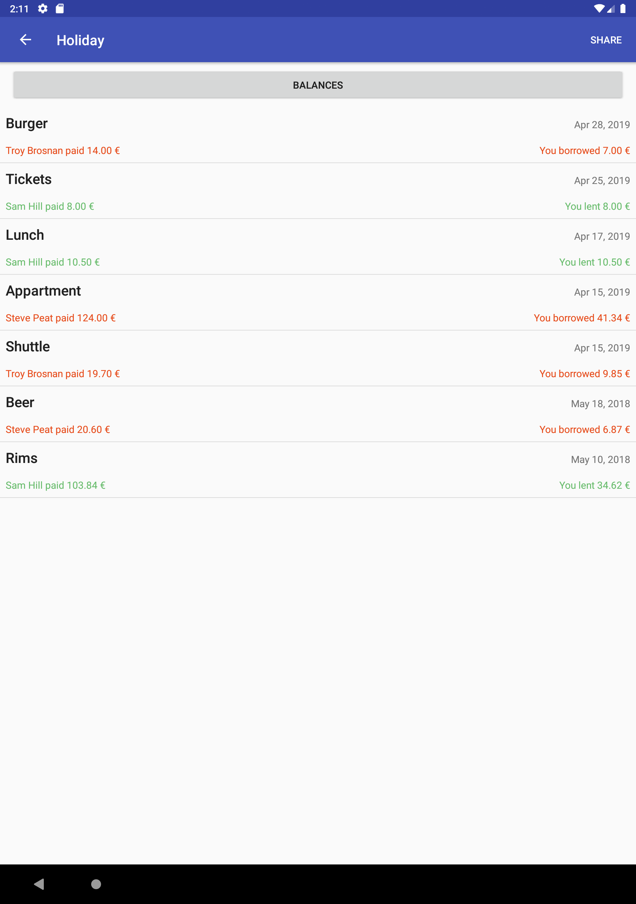
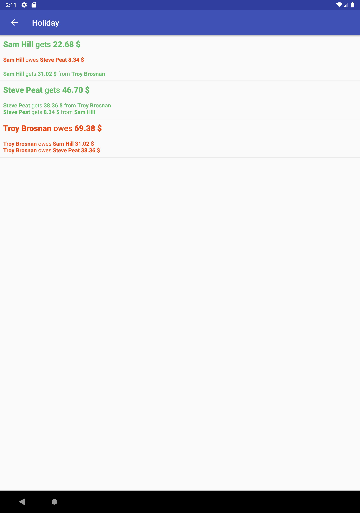
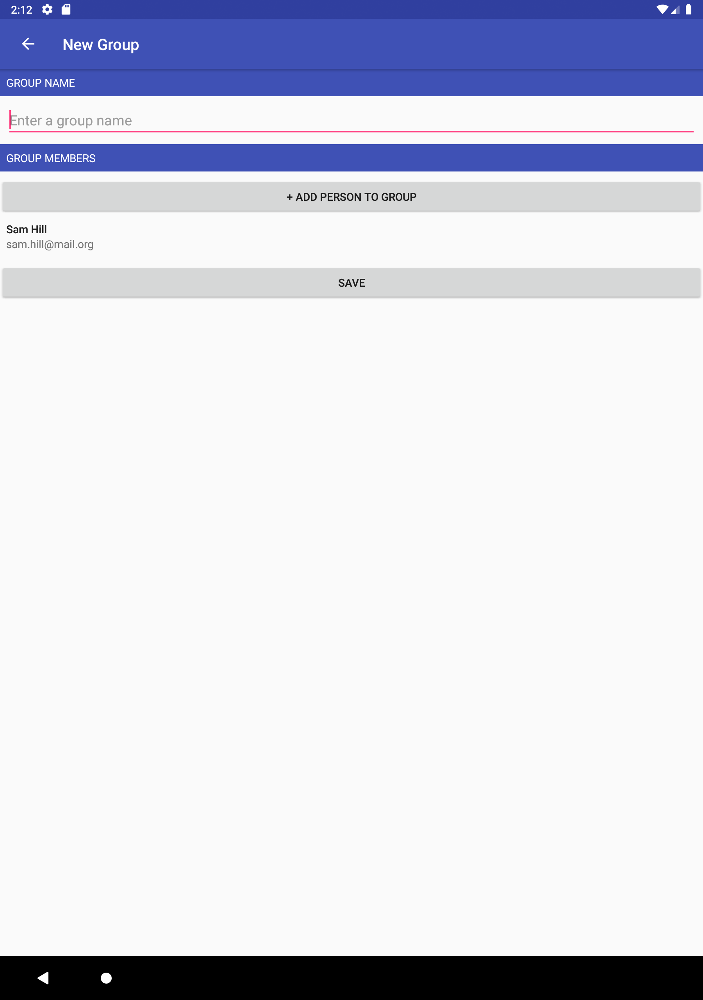
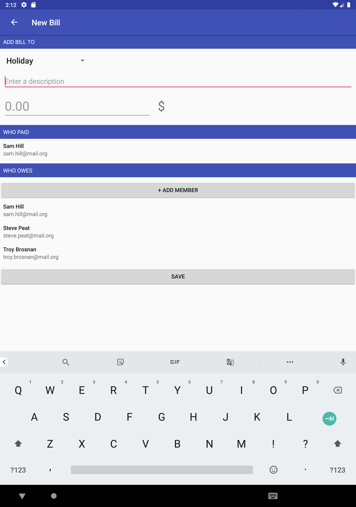
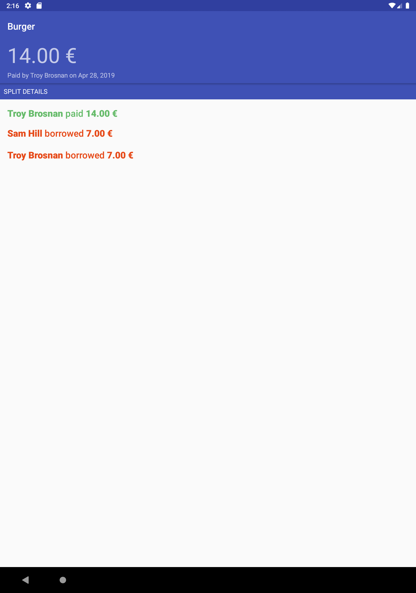
